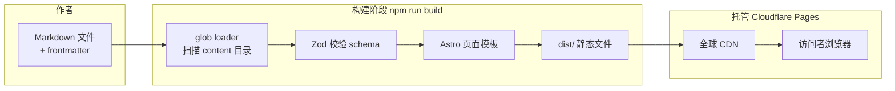
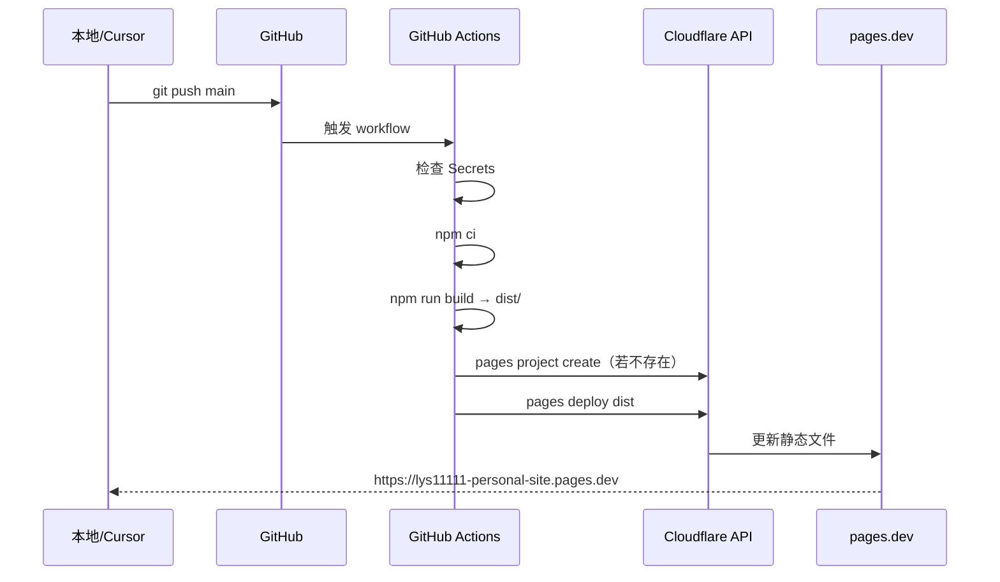
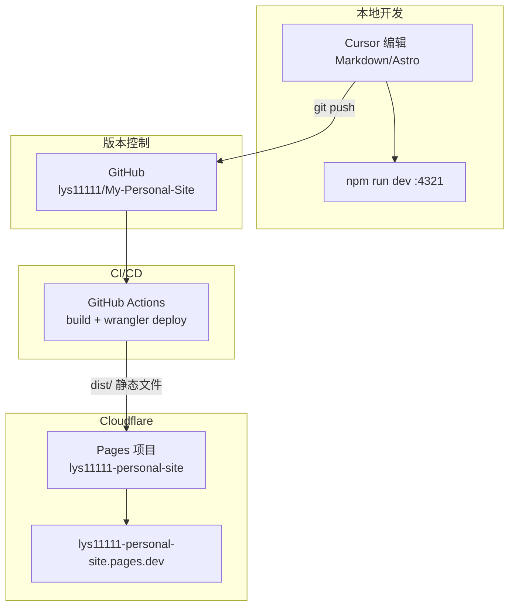

# 个人网站建站与 Cloudflare 部署全记录

> 记录时间：2026-05-29  
> 作者：龙文广  
> 线上地址：https://lys11111-personal-site.pages.dev  
> 代码仓库：https://github.com/lys11111/My-Personal-Site

本文档完整记录从零搭建个人展示网站、推送到 GitHub、并通过 Cloudflare Pages 自动部署的全过程，包括技术选型原理、目录结构、操作步骤，以及实际踩坑与解决方案。

---

## 一、项目目标

### 1.1 要做什么

建立一份**简历的补充说明书**，用于对外展示：

| 内容类型 | 说明 | 示例 |
|----------|------|------|
| 学习笔记 | 跨学科阅读与实践记录 | Prompt 工程、AI 游戏机制 |
| Vibe Coding 项目 | Demo、原型、Git 链接、技术栈 | Shiki 桌宠、AIFIT 健身 App |
| 随笔 / 其他 | 不适合归类的短内容 | 本站运作说明 |

### 1.2 明确不做什么

- 不重复一页纸简历的全部内容
- 不需要后台管理系统（CMS）
- 不需要数据库或服务器运行时
- 不需要在浏览器里可视化编辑（采用 Markdown + Git）

### 1.3 内容工作流（核心需求）

```
在 Cursor 里编辑 Markdown → git commit → git push → 自动构建 → 自动上线
```

---

## 二、技术选型与原理

### 2.1 为什么选 Astro

| 方案 | 优点 | 不选的原因 |
|------|------|------------|
| **Astro 6**（选用） | 专为内容站设计；Markdown/MDX 原生支持；构建极快；输出纯静态 HTML | — |
| Next.js 全栈 | 生态大、可 SSR | 需要 CMS/API 时才值得；本项目只需静态页 |
| WordPress / Notion | 可视化编辑 | 需要额外账号、托管，不符合「Git 管理内容」 |
| Hexo / Hugo | 同样适合博客 | Astro 与现有 React 技术栈更接近，组件化更灵活 |

**原理**：Astro 在构建时（`npm run build`）读取 Markdown 与页面模板，生成纯静态文件到 `dist/`。用户访问时 Cloudflare 只返回 HTML/CSS/JS，无需 Node 服务器。

### 2.2 为什么选 Markdown + Content Collections

**Content Collections** 是 Astro 的内容管理系统：

- 每篇文章/项目是一个 `.md` 文件
- 文件头部 **frontmatter**（YAML）描述元数据（标题、日期、标签等）
- **Zod schema** 在构建时校验格式，写错字段会立刻报错

**原理示意**：



### 2.3 为什么选 Cloudflare Pages

| 需求 | Cloudflare Pages |
|------|------------------|
| 免费 HTTPS | 自带 |
| 全球 CDN | 自带 |
| 连接 GitHub 自动部署 | 支持（本方案用 GitHub Actions + Wrangler） |
| 静态站点托管 | 完美匹配 Astro 的 `dist/` 输出 |

### 2.4 为什么用 GitHub Actions 而不是 Dashboard 直连 Git

两种方式都能部署，最终选择了 **GitHub Actions**：

| 方式 | 说明 |
|------|------|
| **GitHub Actions**（已采用） | 部署逻辑写在 `.github/workflows/` 里，可版本管理、可自定义步骤 |
| Cloudflare Dashboard 直连 Git | 在网页点选配置，适合不想写 workflow 的场景 |

两者**不要同时启用**，否则会重复部署。

---

## 三、项目结构说明

仓库路径：`vibe coding项目/personal-site/`

```
personal-site/
├── .github/workflows/
│   └── deploy-cloudflare-pages.yml   # 自动部署流水线
├── .node-version                     # 固定 Node 22
├── astro.config.mjs                  # Astro + Tailwind + MDX
├── wrangler.toml                     # Cloudflare 项目名与输出目录
├── package.json
├── src/
│   ├── content.config.ts             # Content Collections 定义（Astro 6 格式）
│   ├── content/
│   │   ├── learning/                   # 学习笔记 *.md
│   │   ├── projects/                   # 项目展示 *.md
│   │   └── notes/                      # 随笔 *.md
│   ├── components/                     # 可复用 UI 组件
│   ├── layouts/                        # 页面布局壳
│   ├── pages/                          # 路由（文件即路径）
│   ├── lib/content.ts                  # 工具函数（日期格式化、draft 过滤）
│   └── styles/global.css               # 全局样式 + Tailwind
├── public/                             # 静态资源（favicon 等）
└── dist/                               # 构建产物（git 忽略，部署用）
```

### 3.1 页面与路由

| URL | 对应文件 | 作用 |
|-----|----------|------|
| `/` | `src/pages/index.astro` | 首页：Hero + 精选项目 + 最近学习 |
| `/about` | `src/pages/about.astro` | 关于页 |
| `/projects` | `src/pages/projects/index.astro` | 项目列表 |
| `/projects/xxx` | `src/pages/projects/[...slug].astro` | 项目详情（动态路由） |
| `/learning` | `src/pages/learning/index.astro` | 学习笔记列表 |
| `/learning/xxx` | `src/pages/learning/[...slug].astro` | 笔记详情 |
| `/notes` | `src/pages/notes/index.astro` | 随笔列表 |

**原理**：Astro 的 `pages/` 目录采用**文件系统路由**。`[...slug].astro` 是 catch-all 动态路由，根据 content 集合里的 slug 在构建时生成所有详情页 HTML。

### 3.2 三种内容类型的 frontmatter

**学习笔记**（`src/content/learning/*.md`）：

```yaml
---
title: "文章标题"
description: "一句话摘要"
date: 2026-05-29
category: "AI产品"        # 主分类
tags: ["Prompt", "AIGC"]
featured: false           # 是否在首页突出
draft: false              # true = 本地可预览，生产构建不发布
---
```

**项目展示**（`src/content/projects/*.md`）：

```yaml
---
title: "English Name · 中文名"
description: "一句话描述"
date: 2026-05-29
status: "prototype"         # demo | prototype | archived
tags: ["Electron"]
demoUrl: "https://..."      # 可选：在线 Demo
repoUrl: "https://github.com/..."  # 可选：仓库链接
featured: true
techStack: ["Electron", "Vite", "Python"]
platform: "web"             # android | web — 项目列表页按端分组
draft: false
---
```

项目 `title` 统一为 **「英文名 · 中文名」**（先英文、后中文，中间 ` · `），一处维护、全站同步（首页卡片、详情页、导航下拉等）。

**随笔**（`src/content/notes/*.md`）：

```yaml
---
title: "标题"
description: "摘要"
date: 2026-05-29
tags: ["Meta"]
draft: false
---
```

### 3.3 draft 机制原理

`src/lib/content.ts` 中：

```typescript
export function isPublished(draft: boolean): boolean {
  return import.meta.env.PROD ? !draft : true;
}
```

- **开发模式**（`npm run dev`）：`draft: true` 的内容也会显示，方便预览
- **生产构建**（`npm run build`）：`draft: true` 的内容会被过滤，不会出现在线上

---

## 四、建站步骤（从零到可访问）

### 4.1 初始化 Astro 项目

```powershell
cd "z:\Desktop\vibe coding项目"
npm create astro@latest personal-site -- --template minimal --install --no-git --typescript strict -y
cd personal-site
npx astro add tailwind mdx -y
```

得到：Astro 6 + Tailwind CSS 4 + MDX 支持。

### 4.2 定义内容模型

创建 `src/content.config.ts`（**注意：Astro 6 必须用此路径**，不能用旧版 `src/content/config.ts`）。

使用 `glob` loader 扫描各 content 子目录，Zod schema 校验 frontmatter。详见仓库内该文件。

### 4.3 实现页面与组件

按顺序实现：

1. **Layouts**：`BaseLayout`（HTML 壳）→ `PageLayout`（导航+页脚）→ `ArticleLayout`（文章详情头）
2. **Components**：`Navbar`、`Footer`、`ProjectCard`、`ArticleCard`、`TagList`
3. **Pages**：首页、关于、三个 content 类型的列表页 + 动态详情页
4. **Styles**：深色主题、思源宋体标题、琥珀色 accent

### 4.4 导入种子内容

首批从工作区现有项目整理摘要写入 Markdown（非复制整个代码库）：

| 网站 slug | 来源目录 |
|-----------|----------|
| `shiki-desktop-pet` | `桌宠开发-shiki/` |
| `aifit-mobile` | `AI项目/AI健身/AI健身app/` |
| `liangxiangzhi` | `AI项目/AI面相识别与卦算 两相知/` |
| `prompt-json-constraints` | 开为实习 / Prompt 实践材料 |
| `ai-game-mechanics` | `AI项目/AI 游戏相关/` |

### 4.5 本地验证

```powershell
cd personal-site
npm run dev      # http://localhost:4321
npm run build    # 输出到 dist/，必须通过才算可部署
npm run preview  # 本地预览构建结果
```

---

## 五、工作区整理（建站前顺带完成）

`AI项目/` 目录此前混有简历文件与项目代码，做了**最小整理**（未移动项目文件夹）：

```
AI项目/
├── 00-简历与求职/          ← 新建，收纳 7 份简历 md + _extracts/ 临时 txt
├── README.md               ← 目录索引
├── AI健身/                 （未动）
├── 开为科技工作记录/        （未动）
└── ...其他项目/            （未动）
```

删除：根目录空文件 `提示词重构prompt.md`、无意义 `新建 文本文档.txt`。

---

## 六、Git 与 GitHub 推送

### 6.1 初始化仓库

```powershell
cd personal-site
git init
git add .
git commit -m "Initial commit: personal portfolio site with Astro 6."
git branch -M main
git remote add origin git@github.com:lys11111/My-Personal-Site.git
git push -u origin main
```

### 6.2 SSH 密钥（本机首次推送时）

若推送报 `Permission denied (publickey)`：

1. 检查 `C:\Users\LONG\.ssh\` 是否有密钥
2. 若无，生成：`ssh-keygen -t ed25519 -C "你的邮箱" -f ~/.ssh/id_ed25519 -N '""'`
3. 复制公钥：`Get-Content ~/.ssh/id_ed25519.pub`
4. 添加到 GitHub：https://github.com/settings/keys
5. 再执行 `git push`

**原理**：GitHub 通过 SSH 公钥识别你的身份，私钥留在本机，不进入仓库。

---

## 七、Cloudflare Pages 部署配置

### 7.1 仓库内配置文件

| 文件 | 作用 |
|------|------|
| `.github/workflows/deploy-cloudflare-pages.yml` | GitHub Actions 流水线 |
| `wrangler.toml` | Cloudflare 项目名 `lys11111-personal-site`，输出目录 `dist` |
| `.node-version` | CI 使用 Node 22 |

### 7.2 GitHub Secrets（一次性）

在 https://github.com/lys11111/My-Personal-Site/settings/secrets/actions 添加：

| Secret 名称 | 获取方式 |
|-------------|----------|
| `CLOUDFLARE_API_TOKEN` | Cloudflare → My Profile → API Tokens → 创建，权限：**Account → Cloudflare Pages → Edit** |
| `CLOUDFLARE_ACCOUNT_ID` | Cloudflare Dashboard 右侧或 Workers & Pages 概览页 |

**原理**：GitHub Actions 运行时读取 Secrets，调用 Cloudflare API 上传 `dist/` 目录。Token 不会出现在代码或日志明文里。

### 7.3 部署流水线步骤拆解



Workflow 各步骤：

1. **Checkout** — 拉取仓库代码
2. **Check Cloudflare secrets** — 缺少 Secret 时立刻失败并提示
3. **Setup Node.js** — 读取 `.node-version` 安装 Node 22
4. **npm ci** — 锁定版本安装依赖
5. **npm run build** — Astro 构建，`dist/` 生成静态站
6. **Create Pages project** — 若 Cloudflare 上尚无项目则创建（`continue-on-error: true`，已存在则跳过）
7. **pages deploy** — Wrangler 将 `dist/` 上传到 Cloudflare Pages

### 7.4 触发部署的两种方式

**方式 A：推送代码（日常推荐）**

```powershell
# 改完 content 或页面后
git add .
git commit -m "docs: 新增一篇学习笔记"
git push origin main
# push 后 Actions 自动运行
```

**方式 B：GitHub 网页手动重跑**

1. 打开 https://github.com/lys11111/My-Personal-Site/actions
2. 左侧点击 **Deploy to Cloudflare Pages**
3. 右上角 **Run workflow** → 分支选 **main** → **Run workflow**
4. 等待约 1～2 分钟，绿色 ✓ 表示成功

适用场景：刚配好 Secrets、想立刻重试，而不想改代码。

### 7.5 线上地址

**https://lys11111-personal-site.pages.dev**

可在 Cloudflare Dashboard → Workers & Pages → `lys11111-personal-site` 查看部署历史、预览 URL、绑定自定义域名。

---

## 八、踩坑与解决方案

### 8.1 Astro 6 Content Collections 报错

**现象**：

```
LegacyContentConfigError: Found legacy content config file in src/content/config.ts
```

**原因**：Astro 6 废弃旧版 `src/content/config.ts`，改用 `src/content.config.ts`，且每个 collection 必须配置 `loader`。

**解决**：迁移到 `src/content.config.ts`，使用 `glob` loader：

```typescript
import { glob } from 'astro/loaders';

const learning = defineCollection({
  loader: glob({ pattern: '**/*.{md,mdx}', base: './src/content/learning' }),
  schema: z.object({ /* ... */ }),
});
```

### 8.2 GitHub Actions 部署失败（npx exit code 1）

**现象**：Build 成功，Deploy 步骤失败。

**常见原因**：

| 原因 | 解决 |
|------|------|
| 未配置 `CLOUDFLARE_API_TOKEN` / `CLOUDFLARE_ACCOUNT_ID` | 在 GitHub Secrets 中添加 |
| Token 无 Pages Edit 权限 | 重新创建 Token 并勾选正确权限 |
| Account ID 填错 | 从 Dashboard 重新复制 |
| Cloudflare 上不存在 Pages 项目 | workflow 已加 `pages project create` 步骤 |

### 8.3 项目名与 pages.dev 地址冲突

**现象**：部署显示成功，但访问 `my-personal-site.pages.dev` 却是别人的网站。

**原因**：`*.pages.dev` 子域名在全局可能已被其他 Cloudflare 用户占用。

**解决**：改用唯一项目名 **`lys11111-personal-site`**，同步修改：

- `wrangler.toml` 的 `name`
- workflow 里的 `--project-name` 和 `pages project create` 名称

**教训**：项目名建议带 GitHub 用户名或个性化前缀，避免通用名如 `my-personal-site`。

---

## 九、日常维护手册

### 9.0 日常编辑流程（复制即用）

在 vibe coding 工作区根目录下：

```bash
cd personal-site
npm run dev          # 本地预览 http://localhost:4321
# 编辑 src/content/learning|projects|notes/*.md
git add . && git commit -m "content: 描述" && git push   # 推送到 main 后自动部署
```

线上约 1～2 分钟更新：https://lys11111-personal-site.pages.dev

### 9.1 放置 Demo 媒体与下载文件

站点无后台上传，资源通过 **`public/` 目录** 或 **外链** 展示，`git push` 后随站点一起部署。

| 类型 | 做法 |
|------|------|
| 截图 / 配图 | `public/images/xxx.png` → 正文 `` |
| 短视频 | `public/videos/demo.mp4` → 正文 `<video src="/videos/demo.mp4" controls width="100%"></video>` |
| 可下载文件 | `public/files/xxx.pdf` → 正文 `[下载说明](/files/xxx.pdf)` |
| Demo / GitHub 链接 | 项目 frontmatter：`demoUrl`、`repoUrl`（详情页顶部按钮） |
| 内嵌网页 | 正文 `<iframe src="https://...">`（目标站须允许嵌入） |

**注意**：单文件建议 < 20MB，Cloudflare 部署上限约 25MB；超大视频用 B 站 / YouTube 外链。frontmatter 的 `cover` 字段暂未在 UI 展示，请用正文插图。

更完整说明见 [`PROJECT_CONTEXT.md`](../PROJECT_CONTEXT.md#放置图片视频文件与外链)。

### 9.2 新增一篇学习笔记

1. 在 `src/content/learning/` 新建 `my-article-slug.md`
2. 填写 frontmatter + 正文
3. `npm run dev` 本地预览
4. `git add . && git commit && git push`

线上 URL：`/learning/my-article-slug`

### 9.3 新增一个项目

1. 在 `src/content/projects/` 新建 md 文件
2. 填写 `demoUrl`、`repoUrl`、`techStack` 等
3. push 后自动部署

### 9.4 写草稿不发布

frontmatter 设 `draft: true`，本地 `npm run dev` 可见，生产构建不会包含。

### 9.5 修改关于页 / 联系方式

编辑 `src/pages/about.astro`，补充邮箱、简历 PDF 链接等。

可将简历 PDF 放到 `public/resume.pdf`，链接为 `/resume.pdf`。

---

## 十、架构总览



---

## 十一、关键命令速查

```powershell
# 进入项目
cd "z:\Desktop\vibe coding项目\personal-site"

# 本地开发
npm run dev

# 构建检查
npm run build

# 提交并部署
git add .
git commit -m "描述你的改动"
git push origin main

# 本地手动部署（需 wrangler login）
npx wrangler pages deploy dist --project-name=lys11111-personal-site
```

---

## 十二、相关链接

| 资源 | URL |
|------|-----|
| 线上站点 | https://lys11111-personal-site.pages.dev |
| GitHub 仓库 | https://github.com/lys11111/My-Personal-Site |
| GitHub Actions | https://github.com/lys11111/My-Personal-Site/actions |
| Cloudflare Dashboard | https://dash.cloudflare.com/ |
| Astro 文档 | https://docs.astro.build/ |
| Cloudflare Pages 文档 | https://developers.cloudflare.com/pages/ |

---

## 十三、后续可扩展（尚未实现）

| 功能 | 说明 |
|------|------|
| Pagefind 全文搜索 | 纯静态搜索，零后端 |
| RSS 订阅 | `/@astrojs/rss` |
| 自定义域名 | Cloudflare Pages → Custom domains |
| 项目 Demo iframe 嵌入 | 详情页嵌入在线 Demo |
| OG 社交分享图 | 自动生成分享预览图 |

---

*本文档随项目迭代更新。若部署流程或项目名变更，请同步修改本文「第七节」与「第十一节」。*
