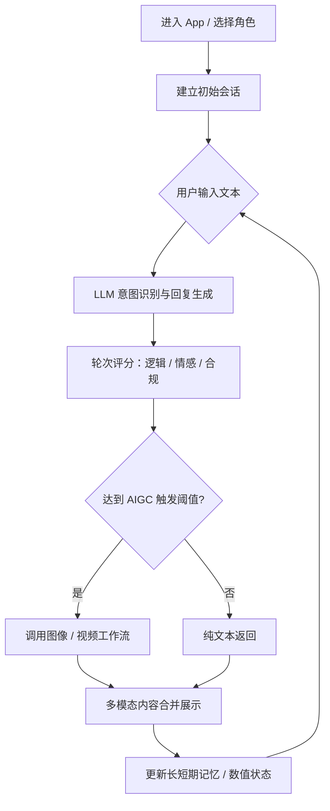

开为科技 AI 游戏工作流实习期间，围绕 **「AI 原生互动叙事」/「沉浸式 AI 角色游戏」** 做了产品调研、机制设计与跨部门协作。本文把实习笔记整理成可复用的学习文档。

---

## 一、产品是什么：对话即游戏

### 业务机制

融合 **LLM + 多模态 AIGC + 游戏化机制**，核心不是「聊天」，而是 **可玩、可控、有反馈的叙事体验**。

| 模块 | 作用 |
| --- | --- |
| 动态叙事引擎 | LLM 根据玩家输入实时生成对话，突破预设剧本树 |
| 多模态反馈 | 按情境生成图片（表情、环境）或短视频（特定动作） |
| 轮次评分 | 对「聊天质量」打分（幽默度、攻略进度、逻辑等），驱动分支、结局与资产解锁 |

### 单薄流程 vs 厚实流程

**单薄：** 玩家输入 → AI 出字 → AI 出图 → 玩家继续输入。

**厚实：** 玩家输入 → AI 评估情绪/规则 → 修改世界参数 → 多模态反馈 + 新剧情钩子（悬念/任务/矛盾）→ 进入新逻辑分支。

按题材强化不同轴心：悬疑类强化多模态线索；情感养成类强化情绪波动系统。

---

## 二、市场需求：三层需求与应用场景

### 需求分层

| 层级 | 核心链接 | 典型用户 | 动机 |
| --- | --- | --- | --- |
| 浅层（感官/即时） | AIGC 图/视频作视觉锚点 | 视觉猎奇者、极速体验派 | 快速情绪刺激，换装、看 AI 做特定动作 |
| 中层（情感/陪伴） | 对话建立「赛博羁绊」 | 情感寄托者、深度 Roleplayer、IP 粉 | 低成本社交；永远在线、可人格校准的「灵魂伴侣」 |
| 深层（探索/投射） | 剧情与轮次问答触达自我面向 | 剧本杀/海龟汤爱好者、叙事创作者 | 测试边缘场景，满足掌控权、被爱、挑战权等心理需求 |

### 应用场景

**娱乐向（C 端）：** 感官刺激 + 情感投射——画质、人设极端性、分享便捷性。

**功能向（B 端/工具）：** 逻辑反馈 + 专业知识——轮次评分公正性、垂直语料深度。

| 方向 | 示例 |
| --- | --- |
| 历史与人文 | 与苏格拉底、武则天等对话；实时生成符合时代的服饰与环境 |
| 专业技能模拟 | 难缠客户（销售）、危机公关、医患沟通——表情视频模拟社交压力 |
| 心理辅助 | AI 树洞、压力宣泄——治愈系氛围场景（壁炉、雨夜、森林） |
| 品牌营销 | 吉祥物与用户玩问答游戏，替代硬广 |

---

## 三、玩法创新方向

| 方向 | 思路 |
| --- | --- |
| 反向攻略与情绪张力 | AI 不一味讨好；不可预知事件增加张力 |
| 叙事管理者 | 从「对话伙伴」升级为「叙事管理者」「世界驱动者」 |
| 隐藏状态机 | 对话形成世界状态的负反馈，而非纯线性回复 |
| 多模态联动 | 图像寻踪/视频解谜；文字聊天升级为文字解谜 |
| 社交化协同 | 叙事接力、平行宇宙——「剧本漂流瓶」分享独特剧情切片 |

---

## 四、竞品与护城河

### 竞品格局

| 类型 | 代表 | 特点与痛点 |
| --- | --- | --- |
| 超级平台 | Character.ai | 海量角色库；过度商业化、严格过滤导致自由度下降、用户流失 |
| 垂直替代 | Crushon.AI、Candy AI | 抓住「无审查」痛点，强调大尺度情感互动 |
| 叙事技术型 | Convai | 游戏化引擎底层，NPC 动态行为与逻辑一致性，偏 B 端 |

### 三类护城河

1. **叙事框架（剧情生命周期管理）**  
   用户玩的是「游戏」不是「聊天」。轮次分数、难度、分支挑战构成难以复制的 **玩家心流曲线**。

2. **多模态严丝合缝**  
   文字、图、视频严格遵循当前叙事语境——不乱码、不离题、氛围精准。

3. **游戏化叙事框架（真正 Moat）**  
   - **叙事状态机：** 好感度、记忆提取、事件触发等隐形规则  
   - **长线记忆：** 记住 100 天前的细节并提起——「被记住」是情感链接的高级形式  
   - **多模态叙事同步：** 提到阴天，图里立刻乌云、BGM 调低——传统游戏高成本，算法可自动化

### 跨赛道借鉴（Galgame / 互动影视）

| Galgame 优势 | 可迁移点 |
| --- | --- |
| 精良美术、文案、视听同步 | 关键转折点 CG 精心设计 |
| 「伪自由」叙事张力 | 倒计时、高危选项制造焦虑感（如《隐形守护者》） |
| 角色缺陷刻画 | AI 需植入偏见、执念、恐惧，而非完美人设 |

**Galgame 劣势：** 不可重玩性——知道结局后魅力大减。AI 互动叙事的机会正在 **无限分支 + 个性化记忆**。

**产品建议：** 避免过度审查；不要试图讨好所有人。

### 重点调研对象

| 产品 | 调研重点 |
| --- | --- |
| Character.ai | Group Chat、Discovery 分类；RPG / Psychologist / Genshin 标签顶流角色 |
| Talkie AI | 视觉驱动、Card Collection、语音+生图无缝体验 |
| Linky AI | Selfie、Roleplay Scenes；Trendy Girl、Secret Relationship 类封面剧情感 |
| Poly.ai | Opening Line 情绪反差；Enemy、Bully、Forbidden Love 高压人设 |
| Janitor AI | Lorebooks、Slow Burn、Enemies to Lovers 标签体系 |
| Candy.ai | 高水准 AIGC 视觉反馈；图/视频请求业务逻辑 |
| Convai | Unity/Unreal 接入、3D/实时交互工作流 |

**混合商业模式示例：** 白天是专业咨询助手（功能向）；触发特定轮次分数或关键词后，AIGC 变换服装与背景，解锁「私密/隐藏叙事」模式。

---

## 五、数据化运营：Workflow 而非 Agentic AI

能力要求：**技术底层（AIGC/LLM）+ 产品运营（数据驱动）**。

### 核心量化指标

#### 工程性能

| 指标 | 含义 | 优化优先级 |
| --- | --- | --- |
| **TTFT** | 首 Token 延迟，最影响体感 | 模型能力 > 工程节点（精确判断、机翻、分数工程化）> 提示词（约 3000 字 / 4000 token） |
| **TPOT** | 每输出 token 耗时 | 流式输出 |
| **SR** | LLM + SD/Kling 等 API 成功率 | 控制并发、规范生图模式、调 temperature/top-p |
| **Token 转化比** | 每轮 Token 消耗 vs 停留时长 | 限制输出长度与思考时间；管理历史记忆体积 |

#### 内容质量

| 指标 | 量化方式 |
| --- | --- |
| 剧情/人设吸引力 | 首次点击进入率 |
| 人设一致性 | 第 1 轮 vs 第 50 轮性格偏差；复点率、单局时长 |
| 多模态对齐度 | 用户「重刷/换一张」频率 |

#### 用户参与

| 指标 | Benchmark 参考 |
| --- | --- |
| 平均轮次深度 | 优秀产品通常 > 20 轮 |
| 剧情分支触发率 | 隐藏剧情/非预设路径比例 |

### 闭环反馈

**隐性（埋点）：** 广场热门率、问答重选率、长按/保存 AIGC 资产率。

**显性（交互）：** 每轮点赞/踩喂给 RLHF；好感度 100/0 导致结束时观察流失。

**负向抓取：** 自动识别「你刚才说错了」「重复了」等抱怨词，优先 Case Study。

### 优化策略摘要

- **提示词分层：** 主控 + 情感模块 + 记忆模块  
- **多模态：** 关键帧 LoRA 缓存；好感度解锁 vs 轮次触发生成  
- **叙事节奏控制器：** 每 x 轮检查「剧情张力值」，过低时强制注入意外事件  
- **记忆动态滑窗 + KIE：** 每 10 轮 LLM 总结人物关系摘要写入向量库  

**数据结论示例：** 量化重刷率发现情感转折点 30% 意图偏离 → 重构分层 Prompt + 异步预生成 → 重刷率降 15%，平均轮次升 25%。

---

## 六、MVP 工作流与跨部门协作

### PRD 核心逻辑（MVP 1.0）

**定位：** 多模态 AIGC 沉浸式问答剧情游戏。  
**目标：** 文本逻辑、视觉反馈（图/影）、数值系统（轮次分数）深度耦合。

```
输入层：玩家自然语言
处理层：语义解析 → 轮次分数 Score_turn → 结合记忆与分数做状态机跳转
输出层：AI 回复文案 + AIGC 图/短视频
```

### 核心页面（Low-Fi）

| 界面 | 要点 |
| --- | --- |
| 角色大厅 | 动态封面（3–5s 氛围视频）；羁绊等级、解锁章节 |
| 互动主场 | 全屏 AIGC 场景背景；半透明气泡；高分时金色流光 + 角色特写视频 |
| 档案/记忆库 | 解锁瞬间以卡牌沉淀 |

**UI 风格建议：** 极简高端都市风，大留白，参考奢侈品 App 视觉节奏。

### 与前端 UI

AI 产品交互需处理 **生成延迟** 与 **内容不确定性**。

| 维度 | PM 需提供 | 前端需明确 |
| --- | --- | --- |
| 视觉风格 | Figma + 色彩规范 | 响应式断点 |
| 动效节奏 | 参考视频 | Easing 曲线 |
| AIGC 状态 | Pending → Generating → Success/Fail | 超时重连、缺省图 |
| 性能底线 | FPS > 60、首屏时限 | CDN 优先级 |

**关键：状态同步调度器**——若图/视频未 Ready，文字流在最后一句停顿 0.5s，显示「正在构思」微动效，资产就绪后同步展示。

**动效要点：**

- 文本流：SSE + 渐显/微位移；情绪联动流速（愤怒快、忧郁慢）  
- 分数反馈：Lottie 分档动画；Accent Color 随分数变化  
- 场景转场：Cross-fade + `backdrop-filter: blur` 朦胧占位  

**加载方案：**

- BlurHash / 语义占位（生成海滩前先淡蓝渐变）  
- 分支信号到达时静默预载 AIGC 至 IndexedDB  
- Loading 文案戏精化：「AI 正在绘制记忆…」而非「加载中…」

### 与后端 / LLM

| 需求项 | PM 提供 | 后端交付 |
| --- | --- | --- |
| 状态机 | 分支与跳转流程图 | 状态更新 API + 库表 |
| 评分引擎 | 关键词加分、逻辑减分规则 | 延迟 < 200ms |
| AIGC 联动 | 情绪→Tag 视觉字典 | 异步生成 + 缓存 |
| 安全过滤 | 敏感词与 SFW 策略 | Moderation 中间件 |

**状态机：** 区分显式状态（好感度、章节）与隐式状态（阴郁值、怀疑度）；数值触发 vs 语义触发；LLM 无法识别时的兜底状态。

**API 调度：** LLM 流式输出时并行触发 AIGC；预扫描转折点；视频超时 8s 降级为静图。

**Prompt 结构：** System / World / Persona / Memory / Instruction 模块化；强制 JSON 输出（`text`, `emotion`, `score_change`, `visual_hint`）；RAG 检索长期记忆。

### 与运维 / SRE

| 需求项 | PM 提供 | 运维保障 |
| --- | --- | --- |
| 流量画像 | DAU、PCU、QPS；波峰时段 | 自动扩缩容 |
| 显存配置 | 各模型静态/动态显存 | GPU 选型、量化方案 |
| 监控告警 | 黑屏、逻辑死循环等业务错误 | GPU 温度、API 成功率 |
| 降级策略 | 视频 → 图 → 文 | 切流工具、静态资源池 |

**容灾：** SLA 99.9%；HappyOyster 大面积报错时熔断；新手引导等高频剧情资产 CDN 缓存，不走实时渲染。

### 与运营 / 内容

| 交付物 | 内容团队 | 运营团队 |
| --- | --- | --- |
| Persona 模板 | 8 点角色档案含冲突感 | 审核是否符合 Hot Tropes |
| 数值平衡表 | 剧情转折点分值 | 免费额度、视频解锁收费点 |
| 用户画像 | 分标签开场白 Hook | KOL 宣测、投放策略 |

**Persona 标准化：** 核心动机、致命弱点、语言风格、核心记忆 + 视觉锚点（饰品、瞳色）；CMS 填空转 Structured Prompt，锁定 Seed 防「变脸」。

**数值经济学：** 逻辑严密 +10、情感共鸣 +20、辱骂 -50；私密视频阈值如累计 200 分；Sheets 配置一键同步线上。

---

## 七、世界模型在业务中的应用

### 能力边界（现阶段）

| 能力 | 说明 |
| --- | --- |
| 漫游模式 | 第一/第三人称实时探索，动态延展地理边界 |
| 导演模式 | 生成中持续指令（天黑了、镜头拉近），画面无缝响应——**最适合叙事产品** |
| 连续时长 | 约 3 分钟 720p 高保真，够一个剧情片段 |
| 局限 | 复杂流体/光影仍有幻觉；「因果逻辑」需外部 LLM；随机探索存在空间记忆缺失 |

### 实现路径

**路径 A：指令翻译层**

LLM 输出结构化 JSON（环境、角色状态、镜头）→ 映射为多模态 Prompt → 导演模式实时调整画面。

**路径 B：状态机驱动**

LLM 修改世界参数（阴郁度=0.8、NPC 距离=近）→ 世界模型订阅参数流式渲染。

### 产品应用空间

| 模式 | 成熟度 | 说明 |
| --- | --- | --- |
| **剧本控制转场** | 高 | 表白/争吵/进新城 5–10s 视频；可异步预生成、部分缓存，算力可控 |
| **环境叙事** | 中高 | 用户说「我很冷」→ 光影变暗、飘雪——语义实时驱动环境 |
| **分数物理视觉化** | 中高 | 分数高画面稳定明快；分数低镜头晃动局促 |
| **完全随机探索** | 低 | 漫游「屋子后面有什么」；算力极高，转身回来场景可能漂移 |

---

## 八、PM 交付物：流程图与时序图

### 业务总流程



**流程图要点：** 菱形判断节点写清分支条件；必须包含合规拦截与生成失败兜底。

**时序图要点：** AIGC 慢时先推文字再推图（`par` 并行）；参与者：客户端、业务后端、数据库、外部 AI 服务。

### 技术链路（摘要）

```
User → Gateway → Queue → LLM Engine
LLM → Memory DB (Vector) → Contextualized Response
LLM → Score/Emotion Tags → AIGC Controller → ComfyUI/Diffusers → CDN
Gateway ← Aggregated Payload ← User
```

**架构组件：**

- 接入层：WebSocket（先文本后图）  
- 逻辑层：Prompt Orchestrator、独立 Scoring Service  
- 存储层：Redis（上下文）、Vector DB（长线记忆）、PostgreSQL（角色与资产）  

### PRD 功能模块优先级

| 模块 | 优先级 | 内容 |
| --- | --- | --- |
| 角色引擎 | P0 | System Prompt、人设、开场白；短期 20–50 轮 + 向量长期记忆 |
| 对话与逻辑 | P0 | 意图识别；轮次评分 1–100 影响好感与分支 |
| 多模态管道 | P1 | LLM 提取视觉关键词；LoRA 保一致性；转折点 2–3s 视频 |
| 资产管理 | P2 | CG 相册、多端同步 |

**关键 KPI：** 次日留存（剧情悬念）、LTV（高质量资产付费解锁）、平均互动轮次、AIGC 成功率、多模态对齐评分。

---

## 九、小结

纯 LLM 对话没有护城河。**游戏化叙事框架**——状态机、长线记忆、多模态同步——才是 AI 互动叙事产品的底色。工程上优先 Workflow 编排与可量化指标，而非过早追求 Agentic 自治；产品上让用户爱上的是 **你为 AI 构建的那个可玩、可控、有反馈的赛博世界**。

## 延伸阅读

- [AI 互动游戏的产品机制思考](/learning/ai-game-mechanics) — 四类玩法矩阵、玩法×指标、穗潮湾与摸鱼海湾
- [游戏美术 AI 与玩法类型笔记](/learning/game-art-ai-and-genres) — 美术 AI 介入点与玩法家族分类
